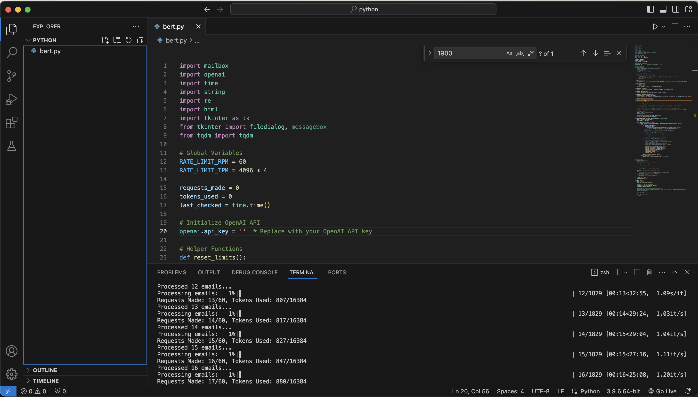

# 📧 Email Sentiment Analysis with OpenAI's GPT-3

Analyze sentiments of emails from your inbox using the power of OpenAI's GPT-3! A Python-based tool designed to process and extract sentiments seamlessly from emails, giving you insight into your communication.



## 📢 AI-Driven Creation
This project stands as a testament to the fusion of human creativity and artificial intelligence. Entirely conceptualized and refined through AI assistance, over 12 hours of meticulous prompt tweaking and iterations have led to this sophisticated tool. Our journey of blending human oversight with AI capabilities promises an innovative future for software development.

## 🌟 Features
- **Intuitive GUI**: Simply select the INBOX file and let the tool handle the rest.
- **Powered by GPT-3**: Utilizes OpenAI's state-of-the-art GPT-3 model for accurate sentiment detection.
- **Clean Processing**: Strips away HTML, unwanted metadata, and extracts the main content of the email.
- **Detailed Reports**: Get sender details, email content, and the sentiment of each email in a .txt report.
- **Rate Limit Handling**: Built-in rate limiting and error handling for a smooth user experience.

## 🛠️ Installation

### Prerequisites

Ensure you have Python 3.x installed on your system. For new users, it's recommended to install [Python](https://www.python.org/downloads/) from the official website.

### Dependencies

After cloning the repository, navigate to the project directory and run the following command to install all required packages:

```bash
pip3 install -r requirements.txt
```

### OpenAI API Key

You'll need an OpenAI API key to access the GPT-3 model. Obtain it from [OpenAI's website](https://www.openai.com/), and replace the placeholder in the code with your key.

## 🚀 Usage

Run the main script:

```bash
python3 bert.py
```

A GUI window will open. Select your INBOX file, and the tool will start processing. Once complete, you will find a `.txt` report in the project directory containing the analysis.

> **Note**: The current script is configured to analyze mbox formatted inbox files. You can obtain your INBOX file from your email service provider (e.g., Gmail offers an option to download your emails in this format via Google Takeout).

## 📸 Screenshots


## 💡 Contributing

Pull requests are welcome! For major changes, please open an issue first to discuss what you would like to change.

## 📜 License

This project is open source and available under the [MIT License](LICENSE).

## 🤝 Acknowledgments

- [OpenAI](https://www.openai.com/) for their robust API.
- Python community for the plethora of helpful libraries.

---

❤️ If you find this tool helpful, consider giving it a star on [GitHub](https://github.com/ritaCosta93/ai-email-sentiment-analyzer)!
